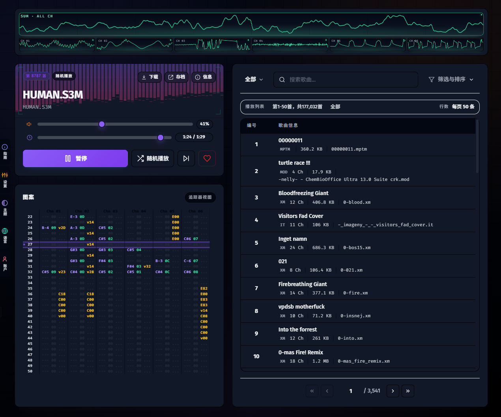

# ModFM (Web-based Tracker Music Player / 网页版 Tracker 音乐播放器)

[](./LICENSE)
[](https://nuxt.com/)
[](https://lib.openmpt.org/)

[English](#english) | [简体中文](#简体中文)

---

<a id="english"></a>
# ModFM (English Version)

ModFM is a web-based Tracker format music player built with Nuxt.js, WebAssembly (libopenmpt), and the Web Audio API (AudioWorklet). It supports playing various retro tracker formats (such as MOD, XM, S3M, IT, etc.) and integrates a SidWiz-style oscilloscope visualizer to display stable real-time waveforms for each channel.



---

## Tech Stack
- **Core Framework**: Nuxt.js (Vue 3 / TypeScript)
- **Audio Decoding**: `libopenmpt` compiled to WebAssembly
- **Audio Playback**: Web Audio API (AudioWorklet) running on an asynchronous rendering thread
- **Waveform Rendering**: Waveform extraction and Canvas real-time rendering based on the `SidWiz` algorithm
- **Styling**: Tailwind CSS

---

## Directory Structure

```
modfm/
├── app/                  # Frontend views and interactive components (Vue 3 / Nuxt 3)
├── chiptune/             # AudioWorklet logic and WASM packaging scripts
├── data/                 # Local data storage (ignored, containing .gitkeep)
│   └── music/            # Default local folder for music files
├── libopenmpt/           # C/C++ core decoding library with the ported SidWiz algorithm
├── public/               # Static assets (including compiled WASM glue files)
├── server/               # Backend API routes and SQLite database integration layer
│   ├── db.ts             # Database initialization and schema setup
│   └── utils/
│       └── scanner.ts    # Incremental music directory scanner
├── types/                # TypeScript declaration files
├── package.json          # Project dependencies and scripts
├── LICENSE               # MIT open-source license file
└── BUILD_libopenmpt.md   # WebAssembly build instructions for the core library
```

---

## Prerequisites

- **Node.js**: `node >= 18.0.0`
- **Package Manager**: `npm` or `pnpm` is recommended
- **C/C++ Toolchain** (Optional): Only required if you modify and need to rebuild the `libopenmpt` WebAssembly binary. Local installation of [Emscripten SDK](https://emscripten.org/) is required.

---

## Environment Variables

The project supports runtime configuration via the following environment variables:

| Variable | Description | Default | Example |
| :--- | :--- | :--- | :--- |
| **`MUSIC_PATH`** | Custom absolute path to scan for music files. If not specified, it defaults to the local `data/music` directory. | `[Project Root]/data/music` | `/var/music/my_mods` |
| **`PORT`** | The listening port for production preview (`npm run preview`) or dev mode. | `3400` (preview) / `3401` (dev) | `8080` |

---

## Quick Start

### 1. Install Dependencies
```bash
# npm
npm install

# pnpm
pnpm install
```

### 2. Development Server
Start the development server (default port 3401):
```bash
npm run dev
```
Open `http://localhost:3401` in your browser.

### 3. Production Build & Preview
Build the application for production:
```bash
npm run build
```
Preview the production build (default port 3400):
```bash
npm run preview
```

---

## Development & Configuration Guide

### 1. Database Setup
The server uses SQLite (via the `better-sqlite3` driver):
- **Automated Setup**: On the first launch, the app automatically creates a `data/` directory and `app.sqlite` database file in the project root, initializing all schema tables (`users`, `songs`, `favorites`, etc.) and indexes. **No manual SQL scripts are required**.

### 2. Music Import & Scan
- **Default Path**: Place your music files (such as `mod`, `xm`, `it`, `s3m` tracker modules, or traditional `mp3`, `ogg`, `wav` files) in the local `data/music/` folder, or specify a custom directory using the `MUSIC_PATH` environment variable.
- **Scanning Mechanism**:
  - **First-run Auto Scan**: If the database `songs` table is empty upon startup, a background incremental scanner automatically populates the database from the designated path.
  - **Manual Trigger**: Send a `POST` request to `/api/admin/scan` to manually force an incremental scan and clean up obsolete records.

### 3. Custom Modifications to libopenmpt (Vendored Modifications)
To enable real-time, jitter-free oscilloscope rendering, we deeply integrated and customized the `libopenmpt` decoder. All modifications are in the `libopenmpt/` folder:
- **Waveform Processor**: Added [waveform_processor.c](file:///www/wwwroot/trackerplayer/modfm/libopenmpt/soundlib/waveform_processor.c) and [waveform_processor.h](file:///www/wwwroot/trackerplayer/modfm/libopenmpt/soundlib/waveform_processor.h) to implement the C version of the `PeakSpeedTrigger` alignment algorithm, 1-pole high-pass filter, and adaptive period tracking.
- **Mixer Interception**: Modified [Fastmix.cpp](file:///www/wwwroot/trackerplayer/modfm/libopenmpt/soundlib/Fastmix.cpp) to intercept raw PCM float outputs from each active channel and feed them into the waveform processor.
- **Interface Exposure**: Modified [Sndfile.cpp](file:///www/wwwroot/trackerplayer/modfm/libopenmpt/soundlib/Sndfile.cpp) to reset the processors when loading a track and export WASM bindings for the frontend AudioWorklet to read the stabilized waveform buffers.

> [!TIP]
> If you make changes to the C/C++ files under `libopenmpt/` and need to compile it, please refer to the [WASM Build Guide](./BUILD_libopenmpt.md).

---

## License & Third-Party Credits

The primary codebase of ModFM is licensed under the **[MIT License](./LICENSE)**.

This project vendors or links with several open-source subprojects:
1. **libopenmpt** (located at [libopenmpt/](./libopenmpt)) - **BSD-3-Clause License**. Copyright (c) 2004-2026 OpenMPT Developers. Used for tracker decoding.
2. **SidWiz** (algorithm reference) - **MIT License** reference. The waveform synchronization logic (PeakSpeedTrigger & adaptive width) is ported from Maxim's [SidWizPlus](https://github.com/maxim-zhao/SidWizPlus).
3. **chiptune3.worklet.js** (located at [chiptune/](./chiptune)) - **MIT License**. Custom fork based on DrSnuggles' chiptune3.js framework.

### NPM Dependency Licenses
- `@nuxtjs/color-mode`: MIT
- `bcryptjs`: BSD-3-Clause
- `better-sqlite3`: MIT
- `nuxt`: MIT
- `vue`: MIT
- `vue-router`: MIT
- `@nuxtjs/tailwindcss`: MIT
- `@types/node`: MIT

---

<a id="简体中文"></a>
# ModFM (中文版)

ModFM 是一个基于 Nuxt.js、WebAssembly (libopenmpt) 和 Web Audio API (AudioWorklet) 实现的网页端 Tracker 格式音乐播放器。它支持播放各种常见的复古 Tracker 模块文件（如 MOD, XM, S3M, IT 等），并集成了 SidWiz 示波器波形可视化功能，可清晰展示多通道实时波形。


---

## 技术栈
- **核心框架**: Nuxt.js (Vue 3 / TypeScript)
- **音频解码**: WebAssembly 编译的 `libopenmpt`
- **音频播放**: Web Audio API (AudioWorklet) 异步渲染线程
- **波形绘制**: 基于 `SidWiz` 的波形提取与 Canvas 实时渲染
- **样式设计**: Tailwind CSS

---

## 目录结构 (Directory Structure)

```
modfm/
├── app/                  # 网页端界面与交互逻辑 (Vue 3 / Nuxt 3 页面与组件)
├── chiptune/             # AudioWorklet 核心逻辑与 WASM 封包工具
├── data/                 # 本地数据存放目录 (被忽略，包含 .gitkeep 占位)
│   └── music/            # 默认本地音乐存放文件夹
├── libopenmpt/           # 移植了 SidWiz 波形对齐算法的 C/C++ 核心解码库源码
├── public/               # 静态资源（包括打包好的 WASM 胶水层文件）
├── server/               # 后端 API 路由及 SQLite 数据库交互层
│   ├── db.ts             # 数据库初始化与表结构配置
│   └── utils/
│       └── scanner.ts    # 音乐目录增量扫描器
├── types/                # TypeScript 类型定义文件
├── package.json          # 项目依赖及运行脚本配置
├── LICENSE               # MIT 开源授权许可证
└── BUILD_libopenmpt.md   # WebAssembly 核心解码库编译构建指南
```

---

## 环境要求 (Prerequisites)

- **Node.js**: `node >= 18.0.0`
- **包管理器**: 推荐使用 `npm` 或 `pnpm`
- **C/C++ 编译链** (可选): 仅当需要修改并重新编译 `libopenmpt` 的 WebAssembly 解码库时，才需要本地安装并配置 [Emscripten SDK](https://emscripten.org/)。

---

## 环境变量说明 (Environment Variables)

本项目支持通过以下环境变量对应用进行运行时配置：

| 变量名 | 说明 | 默认值 | 样例 |
| :--- | :--- | :--- | :--- |
| **`MUSIC_PATH`** | 自定义外部音乐资源存放的绝对路径。如果不配置，系统将默认读取本地项目下的 `data/music` 文件夹。 | `[项目根目录]/data/music` | `/var/music/my_collected_mods` |
| **`PORT`** | 应用在构建预览 (`npm run preview`) 或运行时的监听端口。 | `3400` (预览模式) / `3401` (开发模式) | `8080` |

---

## 快速开始

### 1. 安装依赖
```bash
# 使用 npm 安装
npm install

# 或使用 pnpm
pnpm install
```

### 2. 开发服务器
启动本地开发服务器（默认端口 3401）：
```bash
npm run dev
```
启动后在浏览器中访问 `http://localhost:3401`。

### 3. 生产环境构建与预览
打包构建生产环境版本：
```bash
npm run build
```
预览已构建的生产版本（默认端口 3400）：
```bash
npm run preview
```

---

## 开发与配置说明 (Development & Configuration Guide)

### 1. 数据库构建 (Database Setup)
本项目在服务端使用高性能的 SQLite 嵌入式数据库（配合 `better-sqlite3` 驱动）：
- **自动初始化**：在首次启动应用时，程序将自动在项目根目录创建 `data/` 文件夹及 `app.sqlite` 数据库，并自动执行建表（创建 `users`、`songs`、`favorites` 等表结构及对应的高效索引），**无需任何手动 SQL 导入或手动配置数据库**。

### 2. 音乐文件导入 (Music Import & Scan)
- **存放路径**：请将您的音乐文件（支持各种主流 Tracker 格式如 `mod`、`xm`、`it`、`s3m` 等，以及 `mp3`、`ogg`、`wav` 等传统音频）放入本地的 `data/music/` 目录中，或者通过 `MUSIC_PATH` 环境变量指定外部路径。
- **导入机制**：
  - **自动首次扫描**：项目启动时若检测到数据库中歌曲记录为空，将自动触发一次对音乐存放目录的后台异步全盘增量扫描并写入数据库。
  - **手动扫描更新**：管理员可以通过向 API 接口 `/api/admin/scan` 发送 `POST` 请求（可以通过前端管理面板或手动 Curl），来强制触发对音乐文件夹的增量扫描、更新和废弃资源清理。

### 3. 第三方编译及源码修改说明 (Vendored Modifications)
为了实现示波器波形实时的平滑锁相，本项目对内置的 `libopenmpt` 解码器进行了深度集成与定制修改，相关改动已全部包含在 `libopenmpt/` 源码中：
- **新增波形计算模块**：在 `libopenmpt/soundlib/` 目录下新增了 [waveform_processor.c](file:///www/wwwroot/trackerplayer/modfm/libopenmpt/soundlib/waveform_processor.c) 和 [waveform_processor.h](file:///www/wwwroot/trackerplayer/modfm/libopenmpt/soundlib/waveform_processor.h)，用 C 语言全新移植实现了原版 C# `SidWiz` 的 `PeakSpeedTrigger` (峰速触发) 对齐算法、一阶高通滤波、自适应波形周期分析以及数据归一化逻辑。
- **音频混音拦截**：修改了 [Fastmix.cpp](file:///www/wwwroot/trackerplayer/modfm/libopenmpt/soundlib/Fastmix.cpp)，在声道混音的底层循环中拦截每一个通道产生的原始 PCM 浮点音频信号，将其喂入对应的通道环形环形缓冲区。
- **接口初始化与暴露**：修改了 [Sndfile.cpp](file:///www/wwwroot/trackerplayer/modfm/libopenmpt/soundlib/Sndfile.cpp)，在歌曲加载重置时完成波形处理器的初始化，并向 WebAssembly 胶水层暴露出提取并计算每个通道当前对齐样本的接口函数。

> [!TIP]
> 如果您修改了 `libopenmpt/` 目录下的 C/C++ 源码并需要重新编译 WebAssembly 库，请详细阅读 [WASM 构建指南](./BUILD_libopenmpt.md) 进行环境配置、库链接及合并打包。

---

## 开源协议与第三方合规声明 (Open Source & Third-Party Licenses)

本项目的主体源代码采用 **[MIT License](./LICENSE)** 开源。

为了实现 Tracker 格式音乐的解码与可视化，本项目直接内置集成或引用了以下第三方开源项目。在修改、分发或商业化使用本项目时，请遵守这些项目的相应协议：

### 1. 内置集成的第三方项目 (Vendored Subprojects)

*   **libopenmpt** (位于 [libopenmpt/](./libopenmpt))
    *   **许可证**: **BSD-3-Clause**
    *   **版权所有**: Copyright (c) 2004-2026, OpenMPT Project Developers and Contributors. All rights reserved.
    *   **说明**: 本项目通过 WebAssembly 技术将 libopenmpt 编译为前端可调用的解码库。

*   **SidWiz** (算法参考)
    *   **许可证**: **MIT** (参考项目许可)
    *   **版权所有**: Copyright (c) 2018 Maxim.
    *   **说明**: 本项目实时示波器波形的「峰速触发 (PeakSpeedTrigger)」与「自适应视口宽度」算法实现和逻辑参考自开源项目 [SidWizPlus](https://github.com/maxim-zhao/SidWizPlus)。本地代码库中已移除其 C# 原始参考目录，仅在 `libopenmpt` 内保留 C 语言移植重写后的核心对齐逻辑。

*   **chiptune3.worklet.js** (位于 [chiptune/](./chiptune))
    *   **许可证**: **MIT**
    *   **版权所有**: 基于 DrSnuggles 的 `chiptune3.js` 播放框架定制修改。

### 2. NPM 依赖声明 (NPM Dependencies)
本项目使用的主要 npm 依赖及其开源许可证如下：

#### 运行时依赖 (`dependencies`)
- `@nuxtjs/color-mode`: MIT
- `bcryptjs`: BSD-3-Clause
- `better-sqlite3`: MIT
- `nuxt`: MIT
- `vue`: MIT
- `vue-router`: MIT

#### 开发期依赖 (`devDependencies`)
- `@nuxtjs/tailwindcss`: MIT
- `@types/node`: MIT
